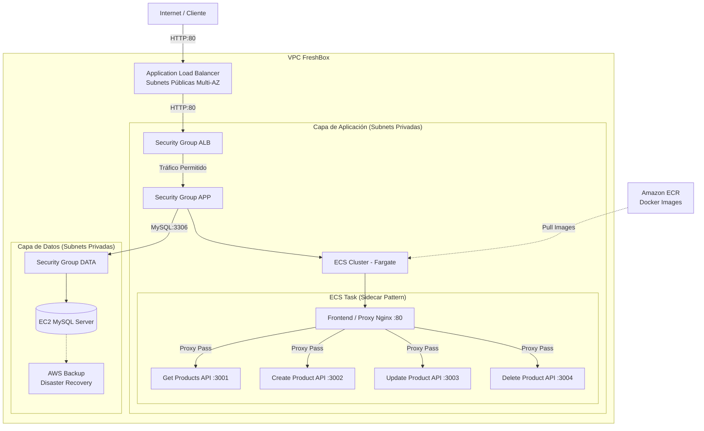

# FreshBox SpA — Arquitectura Cloud EP1

**Evaluación Parcial 1 | ARY1102 Arquitectura Cloud | DuocUC 2026**

## 1. Descripción del Proyecto

FreshBox SpA es una empresa de comercio electrónico especializada en la venta de productos orgánicos, experimentando un crecimiento trimestral del 40%. Este proyecto implementa una arquitectura nativa en la nube (cloud-native) utilizando Amazon Elastic Container Service (ECS) Fargate, infraestructura como código con Terraform, y despliegue continuo mediante GitHub Actions, permitiendo así soportar el rápido crecimiento de la demanda de manera escalable, segura y altamente disponible.

## 2. Arquitectura

La arquitectura diseñada sigue las mejores prácticas de AWS, estructurada en tres capas de red (pública, privada de aplicaciones, privada de datos) con seguridad reforzada.



**Flujo de Seguridad (Grupos de Seguridad Encadenados):**
- **SG-ALB**: Permite tráfico de entrada desde Internet (0.0.0.0/0) al puerto 80.
- **SG-APP**: Permite tráfico de entrada al puerto 80 *solo* desde el SG-ALB.
- **SG-DATA**: Permite tráfico de entrada al puerto 3306 *solo* desde el SG-APP.

## 3. Tecnologías

| Categoría | Tecnología / Servicio | Propósito en el Proyecto |
| --- | --- | --- |
| **Computación (AWS)** | Amazon ECS Fargate | Orquestación de contenedores Serverless para los microservicios. |
| **Computación (AWS)** | Amazon EC2 | Servidor virtual para alojar la base de datos MySQL (Fase 1). |
| **Redes (AWS)** | Amazon VPC & ALB | Aislamiento de red, subredes públicas/privadas y balanceo de carga. |
| **Almacenamiento (AWS)** | Amazon ECR | Registro de imágenes Docker privado y seguro. |
| **Respaldo (AWS)** | AWS Backup | Copias de seguridad automatizadas de la instancia EC2 para Disaster Recovery. |
| **Infraestructura (IaC)** | Terraform | Definición y aprovisionamiento de toda la infraestructura como código. |
| **CI/CD** | GitHub Actions | Automatización de construcción de imágenes Docker y despliegue a ECS. |
| **Aplicación** | Node.js, Express, Nginx | Microservicios backend y proxy reverso frontend. |
| **Base de Datos** | MySQL | Sistema de gestión de bases de datos relacional. |
| **Contenedores** | Docker | Empaquetado de las aplicaciones para portabilidad. |

## 4. Estructura del Repositorio

```text
freshbox-cloud-architecture/
├── .github/
│   └── workflows/
│       └── deploy.yml       # Pipelines de CI/CD para ECS y ECR
├── app/
│   ├── frontend/            # Configuración Nginx y archivos estáticos
│   ├── get-products/        # Microservicio Node.js (Lectura)
│   ├── create-product/      # Microservicio Node.js (Creación)
│   ├── update-product/      # Microservicio Node.js (Actualización)
│   └── delete-product/      # Microservicio Node.js (Eliminación)
├── terraform/
│   ├── main.tf              # Configuración principal de Terraform
│   ├── vpc.tf               # Redes, Subnets, Internet Gateway, NAT
│   ├── security.tf          # Grupos de seguridad encadenados
│   ├── ecr.tf               # Registro de contenedores
│   ├── ecs.tf               # Cluster, Task Definitions, Servicios
│   ├── alb.tf               # Application Load Balancer
│   ├── ec2.tf               # Instancia MySQL
│   ├── backup.tf            # Configuración de AWS Backup
│   ├── variables.tf         # Variables de entrada
│   └── outputs.tf           # Valores de salida (ej. DNS del ALB)
├── docs/
│   └── informe-tecnico.md   # Informe detallado (Well-Architected, Justificación)
├── docker-compose.yml       # Para pruebas locales
└── README.md                # Este archivo
```

## 5. Microservicios

La aplicación está dividida en 5 contenedores que se ejecutan juntos bajo una misma Task Definition en ECS (Patrón Sidecar):

| Contenedor | Puerto Interno | Descripción |
| --- | --- | --- |
| `frontend` | 80 | Proxy Nginx que sirve contenido estático y enruta tráfico a las APIs. |
| `get-products` | 3001 | API para listar y consultar productos. |
| `create-product` | 3002 | API para registrar nuevos productos orgánicos. |
| `update-product` | 3003 | API para modificar productos existentes. |
| `delete-product` | 3004 | API para dar de baja productos. |

## 6. Despliegue Rápido

### Requisitos Previos
- Cuenta de **AWS Academy Learner Lab**.
- Cuenta de GitHub (para CI/CD).
- Terraform CLI instalado localmente.
- Docker instalado (opcional, para pruebas locales).

### Pasos de Despliegue

**Opción A: Despliegue Automatizado (CI/CD GitHub Actions)**
1. Clona este repositorio: `git clone https://github.com/tu-usuario/freshbox-cloud-architecture.git`
2. Inicia tu entorno de AWS Academy Learner Lab y copia las credenciales temporales (`AWS_ACCESS_KEY_ID`, `AWS_SECRET_ACCESS_KEY`, `AWS_SESSION_TOKEN`).
3. Ve a tu repositorio en GitHub > Settings > Secrets and variables > Actions.
4. Agrega las credenciales de AWS como "Repository Secrets".
5. Realiza un commit o ejecuta el workflow manualmente desde la pestaña "Actions" en GitHub.

**Opción B: Despliegue Manual (Terraform CLI)**
```bash
cd terraform
# Inicializar provider de AWS
terraform init
# Verificar plan de ejecución
terraform plan
# Aplicar infraestructura
terraform apply -auto-approve
```
Al finalizar, Terraform mostrará el `alb_dns_name`. Copia esta URL en tu navegador.

## 7. Prueba Local (Docker Compose)

Para probar la arquitectura de microservicios en un entorno local antes de subirla a la nube:

```bash
# Construir e iniciar todos los servicios
docker-compose up -d --build

# Verificar estado
docker-compose ps
```
Accede a `http://localhost` para ver la interfaz.

## 8. Validación CRUD

Una vez desplegado (reemplaza `ALB_DNS` con el DNS real proporcionado por Terraform):

**GET: Listar Productos**
```bash
curl -X GET http://<ALB_DNS>/api/products
```

**POST: Crear Producto**
```bash
curl -X POST http://<ALB_DNS>/api/products \
-H "Content-Type: application/json" \
-d '{"name": "Manzanas Orgánicas", "price": 2500, "stock": 100}'
```

**PUT: Actualizar Producto**
```bash
curl -X PUT http://<ALB_DNS>/api/products/1 \
-H "Content-Type: application/json" \
-d '{"price": 2800}'
```

**DELETE: Eliminar Producto**
```bash
curl -X DELETE http://<ALB_DNS>/api/products/1
```

## 9. Variables de Entorno

Los contenedores de microservicios requieren las siguientes variables para conectar con la base de datos. En producción, estas se inyectan a través de ECS Task Definitions.

| Variable | Descripción | Valor Ejemplo |
| --- | --- | --- |
| `DB_HOST` | Endpoint de la base de datos | `10.0.2.15` (IP Privada EC2) |
| `DB_USER` | Usuario de MySQL | `admin` |
| `DB_PASS` | Contraseña de MySQL | `FreshBox2026!` |
| `DB_NAME` | Nombre de la base de datos | `freshbox_db` |
| `PORT` | Puerto en el que escucha la API | `3001` (varía por API) |

## 10. Autor

**Estudiante**: Arquitecto Cloud en formación  
**Institución**: DuocUC  
**Año**: 2026  
**Asignatura**: ARY1102 Arquitectura Cloud
